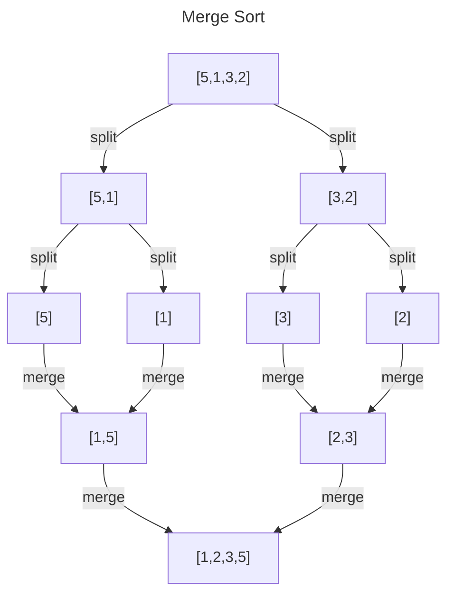
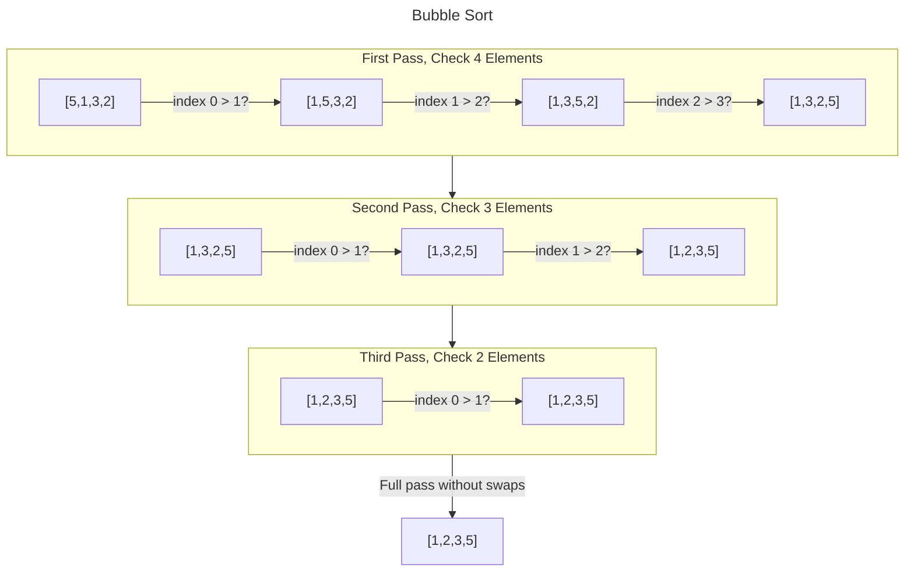
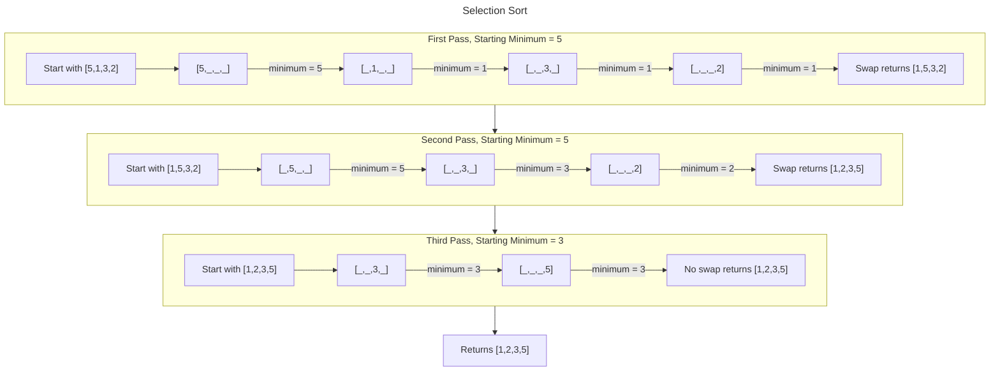
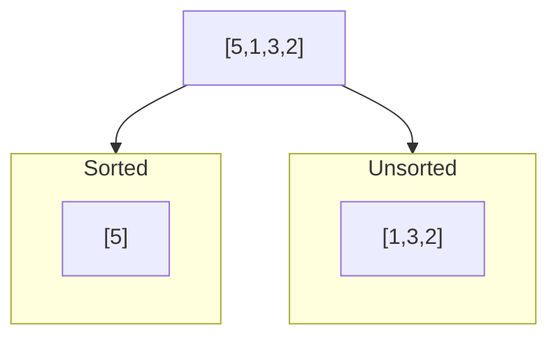
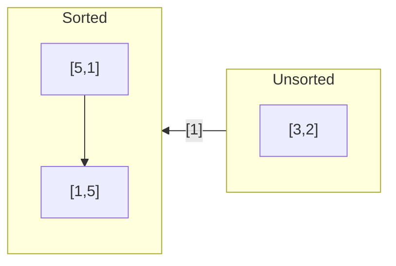
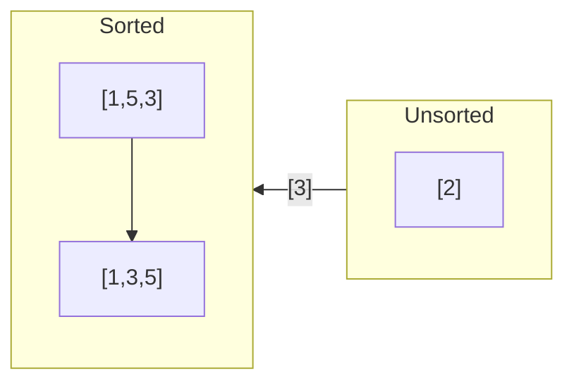
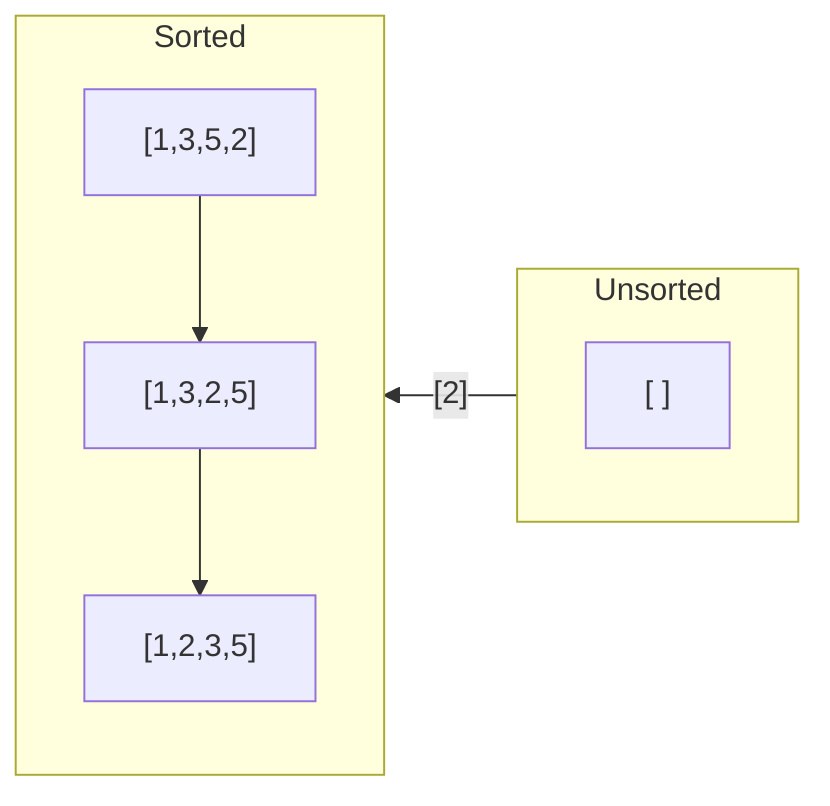

# Contents

- [Project Overview](#project-overview)
- [Algorithms Included](#algorithms-included)
- [Merge Sort](#merge-sort)
- [Bubble Sort](#bubble-sort)
- [Selection Sort](#selection-sort)
- [Insertion Sort](#insertion-sort)
- [Algorithm Comparison](#comparison-of-four-sorting-algorithms)
  - [40 Items](#testing-lists-of-up-to-40-items)
  - [100 Items](#testing-lists-of-up-to-100-items)
  - [1000 Items](#testing-lists-of-up-to-1000-items)
  - [10,000 Items](#testing-lists-of-up-to-10000-items)
  - [Testing Conclusion](#testing-conclusion)
- [Merge-Select Sort](#merge-select-sort)
- [Linear Search](#linear-search)
- [Divide and Conquer Search](#divide-and-conquer-search)

# Project Overview

This "Algorithms Project" folder holds my implementations of various famous algorithms. While they have been implemented by many other people before, I believe that it is difficult to fully understand a piece of code without re-writing it for oneself. I did not copy any of these algorithms from other people but did view how other people wrote their solutions. I found that I often preferred more verbose variable names and detailed docstrings for each function. While it is not fully necessary to have a docstring for simple functions like these that are in small files, I think that one should always use good technique when writing code. The order that I wrote these algorithms in follows the order in which I learned about them. The explanations in this README are written in the order that I wrote the code for the algorithms.

I ended up writing four different sorting algorithms and two different searching algorithms. In the section called "Algorithm Comparison", I ran several efficiency tests to determine whether the sorting algorithms followed their theoretical efficiency when run on actual data. I then created the merge-select algorithm which was my combination of the merge sort and selection sort algorithms based on the results I got when running my efficiency tests. After creating the merge-select algorithm, I then tested it against both of the algorithms that it was created from.

This project gave me practical experience with searching and sorting algorithms, running automated efficiency tests, the `matplotlib.pyplot` module for plotting data, mermaid diagrams, and various other markdown syntax elements. 

# Algorithms Included

(Sorted alphabetically)

| Algorithm Name | Algorithm Type | Description |
| --- | --- | --- |
| Bubble Sort | Sorting | Iterates from the start of the list to the end, swapping two elements at a time and repeating until sorted. |
| Divide and Conquer Search | Searching | Efficient algorithm for searching pre-sorted lists. |
| Insertion Sort | Sorting | Moves elements one space at a time to the left until it is in the correct spot. |
| Linear Search | Searching | Searches all elements starting from the left end of the list. |
| Merge-Select | Sorting | Uses selection sort on small lists and merge sort on large lists. |
| Merge Sort | Sorting | Uses divide and conquer to recursively split a list into smaller and smaller halves. Then sorts the halves when combining them back together. | 
| Selection Sort | Sorting | Checks each element in the list against the current element to see if it is smaller. |

# Merge Sort

Merge sort works by splitting a list into small pieces and then sorting those pieces. In my merge sort file, I included a way to reverse the merge sort by putting the biggest element (instead of the smallest) at the front of the list. I then designed a file to test my merge sort algorithm. In theory, merge sort is supposed to run in O(n log n) time. In my test file, I included a way of testing every list size between 0 and n, incremented in length by 1 for each test. This means, if you want to run 5000 tests, the program will create a randomly sorted list of numbers and then sort it. This will be repeated 5000 times with one extra element added on each time. The tests start with a list of length 0 and ends with a list of length 4999 (because it is the 5000th test). However, the system gets bogged down if you run much more than 5000 tests. To be able to test larger numbers like 100,000, I created a second function to test large numbers. In the function for testing large numbers, each list is 1000 elements larger than the previous list. This gives it a faster runtime. The output for both of these functions was a dictionary with the keys being the size of the list that was sorted and the values being the length of time needed to sort that size of list in milliseconds. At the end of my test file is a function that will take the dictionary of results and plot a graph of its performance.

Here is an example of sorting lists of lengths between 0 and 100,000 using the function call `plot_results(run_big_n_sorts(100_000))`:


Below is a diagram of how merge sort splits all of its elements and then merges them sorted:



# Bubble Sort

Bubble sort is a very inefficient algorithm that runs in O(n²) time and as such is rarely used in practice. It works by comparing two elements at a time and swapping them if they are in the wrong order. It then moves over by one index and checks the second element from the first check and another element. This is repeated until the end of the list. For example, element 0 and 1 are checked, then 1 and 2 are compared, then 2 and 3, 3 and 4, 4 and 5, and so on. Every time the list has been checked all the way through, the last element in the list is the largest and is set in place. Therefore, a way to make the algorithm faster is to check one less element on each pass through the list. While large elements can move multiple spaces on a single pass, small elements take several passes to get to the front of the list. This means the program could get to the end of the list and not know if the earlier elements are completely sorted yet. To account for this, the algorithm can only end if it makes it all the way through the list without needing to make an adjustment. 

Below is an example of sorting lists of lengths between 0 and 10,000, which ran in about the same time as it took to run 10 times the number of tests with the merge sort:


To get a better idea of how much slower bubble sort is than merge sort, here is a graph run on lists of the same length with the two algorithms. Notice how merge sort takes so little time in comparison that it appears to be a flat line:


Below is a digram of how bubble sort works with the optimization of checking one less item per round:



# Selection Sort

The selection sort is another inefficient sorting algorithm with a time efficiency of O(n²). This algorithm sorts by putting the smallest element at the start of the list. It checks every element and keeps track of the smallest item it finds. The smallest item is swapped and locked in place. It then checks the next element against every element in the list to see what the smallest item is out of that section of the list. Because it has to check every remaining element every time, it has relatively similar performance to the bubble sort, if not a little better. One big difference between bubble sort and selection sort is that it sorts from the front instead of from the end. 



# Insertion Sort

Insertion sort is a similar sorting algorithm to selection sort in the sense that it accumulates the sorted items to the left of the list while moving towards the right. One element is selected from the unsorted side of the list. The unsorted element is compared with the element to its left. If it is smaller, it is moved left until it reaches the front of the list or until the elements to its left are smaller than it. Once it is moved into the correct spot, it is considered sorted and the next unsorted element is sorted in the same manner. It is inefficient like selection sort with a time complexity of O(n²). Here's how it works:

Start with an unsorted list like [5,1,3,2]. The first element is considered sorted and sorted elements get moved toward the left.


Add the first unsorted element to the end of the sorted list. Keep moving it toward the front until there are no smaller elements in front of it or it is the first element in the list.


Repeat the process by moving the next unsorted element.


Repeat with the final element.


The list is now sorted.

# Comparison of Four Sorting Algorithms

After implementing the merge sort, insertion sort, selection sort, and bubble sort, I created a way to test the efficiency of all of them side by side. Instead of using the "mergesort-test.py" file that I created originally to test the merge sort, I designed another testing file called "test_four.py". This testing file imports the necessary modules along with the files for each of the different sorting algorithms. In order to set the file up so that it works, download "bubblesort.py", "insertionsort.py", "mergesort.py", "selectionsort.py", and "test_four.py". Save each of these files in the same folder so that they import correctly. The testing file works by running a "test" the amount of times that you tell it while saving the time performance of each test. A "test" is one loop through the `run_test()` funnction where each of the four algorithms is tested on a random list of integers. Every subsequent test adds a certain number of extra elements to be sorted. I included some preset tests of certain lengths. `test_hundred()` runs tests on lists of length 0 to 100 where each test has an additional item in length. `test_thousand()` runs tests on lists of length 0 to 1000 where each test has an additional 100 elements added. Finally, the `test_ten_thousand` tests lists up to 10,000 items in length with each test having 1,000 more elements than the previous test. Any or all of these tests can be run in the interpreter and the results will be stored in a dictionary corresponding to each individual sorting algorithm. The dictionaries' keys are the sizes of the lists that were sorted while the keys are the times needed to sort those lists. I stored the times in terms of milliseconds (ms) to make the values more human readable. An example entry in one of the dictionaries might be {1000: 1.2}. This would mean that sorting a list of 1000 items took 1.2 ms with that particular algorithm.

An example of using the code in the interpreter would look like this:

```
>>> test_ten_thousand()
  Running test 0
  Running test 1000
  Running test 2000
  Running test 3000
  Running test 4000
  Running test 5000
  Running test 6000
  Running test 7000
  Running test 8000
  Running test 9000
  Running test 10000
  Total testing time: 35.0342 seconds
  
>>> plot_results()
# this will show a graph wherever your interpreter sends its graphs
```

If I run these commands in the terminal, my system doesn't show me the resulting graph. However, if I run these commands in Spyder (a Python IDE), I get graphs that clearly show the performance difference in these algorithms. 

### Testing Lists of up to 40 Items

For lists of size 40 and lower, selection sort is the fastest in the majority of cases. Insertion is second best for lists from size 0 to 35, and bubble sort is third best until the lists get greater than about 27 items long. Merge sort actually has the worst performance for most cases and ends up being barely better than insertion sort in lists of 40 items.


Time (in ms) to sort with each algorithm

| List Length | Merge Sort  | Insertion Sort | Selection Sort | Bubble Sort |
|-------------|-------------|----------------|----------------|-------------|
| 0           | **0.00167** | 0.00215        | **0.00167**    | 0.00191     |
| 5           | 0.00405     | **0.00095**    | 0.00143        | 0.00119     |
| 10          | 0.00811     | **0.00286**    | 0.00334        | 0.00477     |
| 20          | 0.0205      | 0.01144        | **0.01001**    | 0.01359     |
| 40          | 0.04268     | 0.04697        | **0.03028**    | 0.06104     |

### Testing Lists of up to 100 Items

When the size of the lists expands to lists of up to 100 items, the true division of the algorithms starts to appear. Once the lists are made of 60 items or greater, merge sort is best, selection sort is second, insertion sort is third, and bubble sort is last. While merge sort is clearly the best, selection sort is still almost twice as fast at sorting 100 elements when compared to insertion sort or bubble sort.


| List Length | Merge Sort  | Insertion Sort | Selection Sort | Bubble Sort |
|-------------|-------------|----------------|----------------|-------------|
| 0           | 0.00143     | 0.00072        | **0.00048**    | 0.00095     |
| 40          | 0.03982     | 0.04196        | **0.03076**    | 0.05317     |
| 60          | **0.06223** | 0.11301        | 0.06938        | 0.12231     |
| 80          | **0.09084** | 0.1936         | 0.11015        | 0.22197     |
| 100         | **0.1173**  | 0.29159        | 0.17095        | 0.3314      |

### Testing Lists of up to 1000 Items

Each of the four algorithms become even more separated when testing lists of lengths up to 1000 elements. Merge sort does so well that it appears to be almost a flat line at the bottom of the graph. Insertion sort and bubble sort seem to grow at nearly the same rate while selection sort performs about twice as fast as either one, no matter the size of the list.


| List Length | Merge Sort | Insertion Sort | Selection Sort | Bubble Sort |
|-------------|------------|----------------|----------------|-------------|
| 0           | 0.00143    | **0.00048**    | 0.00072        | 0.00072     |
| 200         | **0.259**  | 1.048          | 0.634          | 1.403       |
| 400         | **0.591**  | 4.671          | 2.724          | 6.233       |
| 800         | **1.242**  | 20.074         | 11.470         | 24.991      |
| 1000        | **1.582**  | 31.648         | 17.324         | 38.094      |

### Testing Lists of up to 10000 Items

All of the trends continue to get further amplified in this final test. Merge sort appears to take no time at all while bubble sort and insertion sort swell to thousands of times more time intensive. I would complete further tests but the compounding increase in the time required to run the tests would take to long to be practical. Because of the inefficient algorithms involved, even running the tests of up to 10,000 items takes over 35 seconds to complete. Also, there is no practical benefit. It is clear that the time complexity trend of these four graphs will continue indefinitely in the same fashion with merge sort being the most efficient and selection sort being the next most efficient.


| List Length | Merge Sort | Insertion Sort | Selection Sort | Bubble Sort |
|-------------|------------|----------------|----------------|-------------|
| 0           | 0.00095    | 0.00048        | 0.00072        | 0.00072     |
| 5000        | 9.8        | 836.2          | 435.5          | 1000.1      |
| 10,000      | 21.2       | 3319.3         | 1762.6         | 4181.4      |
  
### Testing Conclusion

Merge sort is obviously the best algorithm to use for all cases where the list to sort is 60 items or greater in length. However, if there are less than 60 elements, selection sort is the best algorithm for the job. Ideally, it would be best to create a sorting algorithm that uses selection sort in cases where the length of the list is 60 items or less and uses merge sort for all lists larger than 60 items. This way, it would outperform merge sort in the low end and selection sort in the high end.

# Merge-Select Sort

Using the results of the previous efficiency tests, I wrote a sorting algorithm that uses both merge sort and selection sort. While some have probably already created various versions of this combination algorithm, I call it "merge-select". In the testing section above, I found that selection sort was the fastest algorithm for sorting lists of about 60 items or less and merge sort was fastest for any list of greater size. I used those list size ranges to create the merge-select sort that used the best algorithm for the list based on its size. When I tested merge-select against the other two algorithms, it did exactly what I intended. On small lists, it performed better than merge sort and on large lists it performed better than selection sort. By choosing an algorithm to use based on the situation, I got better overall performance than just sticking to one sorting algorithm alone.

When testing lists of up to 40 elements, merge-select did noticeably better than merge sort:


Then, when testing lists of up to 1000 elements, merge-select took one eighth of the time that selection sort did:


The really interesting section to observe, however, is the narrow section of lists between 50 and 70 elements in length. In this particular graph, you can see the crossing of the three algorithms at a list size of about 62 elements. At that point, merge sort becomes more efficient than selection sort and the merge-select algorithm follows the change over and maintains optimal efficiency the whole time:


While I created an optimization that did what I set out to do and backed it up with testing, does this really make a significant difference? The answer is most likely not. Look at the results in the previous testing section above. The time for merge sort to sort a 10,000 item list was 21 milliseconds while a similar operation took 1762 milliseconds for selection sort. While this is significant, it is the difference between the results showing up in 2 seconds compared to instantaneously. Two seconds is not a lot of time savings for most applications. To see a really significant difference, you would likely need to be sorting lists of sizes around 100,000 or one million elements. Consider the scenario in which you could only choose one of the two sorting algorithms. If you chose merge sort, you would be sacrificing performance in the low end but you would do better with large lists. Since the merge-select algorithm only improves upon the merge sort on the low end, you would have to consider the time savings with small lists. From the graph of lists of 40 elements or less, you can see that this saves 0.01 milliseconds at best. Therefore, to see a time savings of 1 second, you would have to be performing sorting operations on at least 100,000 small lists with 40 elements each. It seems unlikely to me that such intensive sorting would happen on such a large grouping of lists when more value would come from sorting a couple lists of one million elements. In other words, it would be easier to coordinate the meaning behind 4 really large lists as compared to 100,000 really small lists. 

In the end, even if there is no true necessity for the merge-select algorithm, it is nice to know that such optimizations are not only possible in theory, but also possible to implement.

# Linear Search

All of the algorithms above have been sorting algorithms. This means that were designed to take lists of values and sort them in ascending order. The exception is the merge sort algorithm that I built with the capacity to sort in reverse. This next algorithm does not sort a list but rather searches a list. It works by passing the `linear_search()` function a list to search through and an element that you are looking for. It then progresses from left to right in the list, going element by element until it finds the element or reaches the end of the list. While it is not the most efficient way to search through a list for an element, it is the best that you can do when a list is not sorted. If a list is unsorted, you would do just as well searching from left to right as you would by following any sort of pattern. However, if you know that the list is sorted, you could search with a more efficient algorithm. 

In addition to `linear_search()`, I created in the same file `linear_search_verbose()`. This extension of the original search algorithm prints statements to the console as it works that tells what element it is currently searching. It also tells how many tries it took to find the correct element. The example usage is below:

``` 
>>> a_list = [81, 70, 7, 779, 411, 473, 672, 483, 775, 618]

>>> linear_search_verbose(a_list, 100)
Searching for 100 at index 0: ...
Searching for 100 at index 1: ...
Searching for 100 at index 2: ...
Searching for 100 at index 3: ...
Searching for 100 at index 4: ...
Searching for 100 at index 5: ...
Searching for 100 at index 6: ...
Searching for 100 at index 7: ...
Searching for 100 at index 8: ...
Searching for 100 at index 9: ...
Did not find 100 in this list.

# returns the value False

>>> linear_search_verbose(a_list, 483)
Searching for 483 at index 0: ...
Searching for 483 at index 1: ...
Searching for 483 at index 2: ...
Searching for 483 at index 3: ...
Searching for 483 at index 4: ...
Searching for 483 at index 5: ...
Searching for 483 at index 6: ...
Searching for 483 at index 7: ...
Found 483 at index 7.
Search took 8 searches to find the element.

# returns the value 7
```

Additionally, I inserted the `get_list_of_rand_nums()` function that I have been using to create large random lists in the testing files. You can can use it to create a very large list of numbers and choose a random number that you want to search for in that list. 

# Divide and Conquer Search

The divide and conquer search is a more efficient way of searching a list. It is similar to the merge sort algorithm in that it works by splitting the problem in half each time. In specific, it always looks at the middle item of the list first. If the item in the middle is not the item that is being searched for, the list is split in half. Depending on whether the item is bigger or smaller than the middle item determines whether you look at the left or right half of the list. That way, you are always cutting out half of the list area to search. When there are only one or two elements left to search for, the algorithm will look at each one before deciding that the item is not present in the list. My implementation returns either the index of the item that was found or `False` if not found, just like the linear search. The amount searches in the worst case scenario are much less than the linear search. This search method would be much better for large lists, but you would have to have a sorted list. If you use this algorithm on an unsorted list, you will usually get `False` even if the value is present.

I added a `divide_and_conquer_verbose()` function that provides feedback similar to the verbose function in the linear search. An example of usage is below:

```
>>> b_list = [0, 100, 200, 300, 400, 500, 600, 700, 800, 900, 1000]

>>> divide_and_conquer_verbose(b_list, 100)
Searching for 100 at index 5: ...
Searching for 100 at index 2: ...
Searching for 100 at index 0: ...
Searching for 100 at index 1: ...
Found 100 at index 1.
Search took 4 searches to find the element.

# returns the value 1
```
